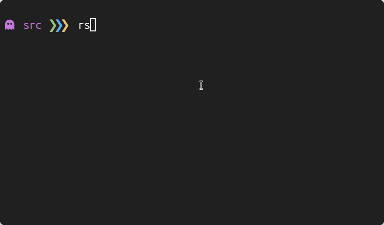
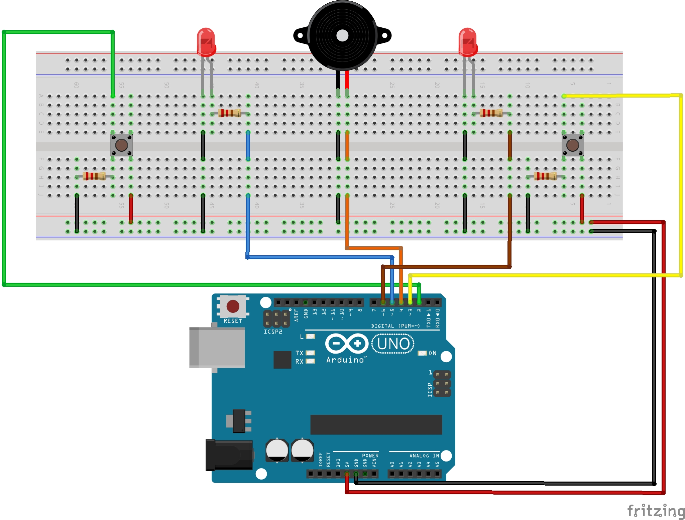

<div align="center">
   <h1>
      Simple Score Counter
   </h1>
   <p align="center">
      Another simple project, made with an Arduino UNO.
      The program is a basic score counter that prints out the score to the serial monitor when 1 of the 2 buttons is pressed.
      When a button is pressed the led will blink and a sound will be played.
      I literally have nothing else to say about it as it is literally nothing special.
   </p>
   
</div>

## Usage

To compile and upload the code to the Arduino enter the following commands.

**NOTE**: The commands below assume you are using an Arduino UNO. Refer to the [docs](https://arduino.github.io/arduino-cli/0.27/getting-started/) for more information.

```
$ cd src/                                                                   # Navigate inside the source directory
$ arduino-cli compile --fqbn arduino:avr:uno score-counter                  # Compile the code
$ arduino-cli upload -p /dev/ttyACM0 --fqbn arduino:avr:uno score-counter   # Upload the compiled code to the Arduino UNO
```

To see the serial output you can use the python script below.

```python
#!/usr/bin/env python3

import serial

ser = serial.Serial('/dev/ttyACM0', 9600, timeout=1)
ser.flush()

while True:
   if ser.in_waiting > 0:
      line = ser.readline().decode('utf-8').rstrip()
      print(line)
```

**NOTE**: don't forget to update the permissions of `/dev/ttyACM0` (`sudo chmod a+rw /dev/ttyACM0`).

## Electrical scheme



